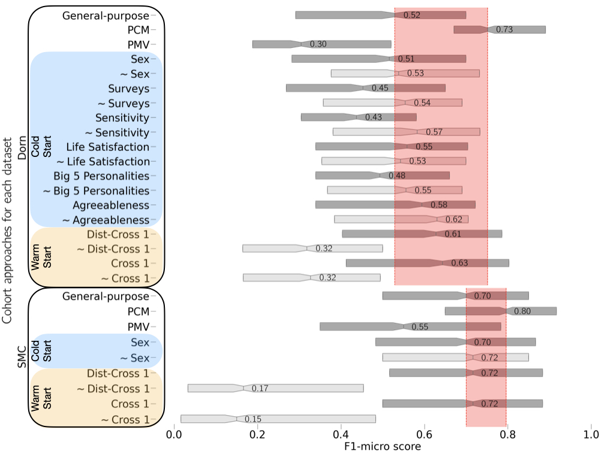
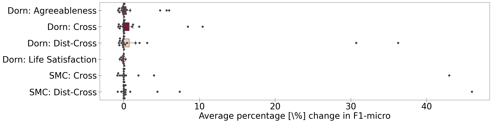

# Cohort Comfort Models (CCM)
[](https://lbesson.mit-license.org/)  

This repository is the official implementation of [Cohort comfort models - Using occupants' similarity to predict personal thermal preference with less data](https://www.sciencedirect.com/science/article/abs/pii/S0360132322009155).

## Requirements

### Python

```setup
conda env create --file envs/environment_<OS>.yaml # replace OS with either `macos` or `ubuntu`
```

### Datasets

We chose the following publicly available field longitudinal datasets:

- [Dorn](https://github.com/FedericoTartarini/dorn-longitudinal-tc-study) TODO: final link for pub
- [SMC](https://doi.org/10.1016/j.buildenv.2018.11.012)

Once the datasets are downloaded into `data/`, the notebook `preprocessing.ipynb` does some pre-processing and creates copies of the datasets with different feature sets.

Each longitudinal dataset has primarily two files:
- One with sensor measurements with the right-here-right-now (RHRH) responses for all participants.
- Another one with the on-boarding one-time survey responses for each participant.

All the pre-processing is handle by the class `DataLoader` defined in `data.py`.

The files needed by the `preprocessing.ipynb` notebook are:

|              File name              |                             Features                                 |
| -------------------------------     | -------------------------------------------------------------------- |
| `df_info_subjects_raw_DORN.csv`     | Original DORN dataset with occupants' information                    |
| `df_cozie_env_raw_DORN.csv`         | Original DORN dataset with environmental and RHRN labels             |
| `210316_SMC_background.csv`         | Original SMC dataset with occupants' information                     |
| `SMC_combined_survey2.csv`          | Original SMC dataset with environmental and RHRN labels              |

All the needed files with the selected features sets, onboarding questions, and number of datapoints per person are defined inside the notebook.

### Settings and parameters

To specify different settings and parameters pertinent to the data being loaded, training, and evaluation, modify the files inside the `configs/` folder as a `yaml` file.

Inside, a description of existing `config` files resides in `config_details.xslx`.

## Training & Evaluation

Personal comfort models (PCM), general-purpose, and cohort models are trained using Cross-Validation (CV) described in `utils.py` under the `train_model` function. The chosen model for all approaches is Random Decision Forest (RDF).

In order to create the different cohorts and assign occupants to them, user profiling is done via the class defined in `user_profile.py`. This class takes care of the cross-model performance between occupants PCMs,the Jensen-Shannon divergence between their distribution responses, and the onboarding responses clustering.
The file `cohort.py` handles the cohorts themselves

Finally, the file `cohort_modeling.py` is an end-to-end initialisation, training, and evaluation of the different cohort modeling approaches. By default the entire process is repeated 100 times to account for stochasticity.

```training
./run_cohort_model.sh configs/{your_config}.yaml
```
The configuration files used for manuscript can be found in the foulder `configs/` alongside a spreadsheet `config_details.xlsx` with details about each configuration file.

## Pre-trained Personal Comfort Models

Trained personal comfort models can be found in the `models/` folder. They are saved in `pickle` format as `dictionaries`.

It is recommended to have the PCM already computed to minimise computation time. The file names are as follows:

`dict_pcm_{model}_{dataset_type}_{dataset_name}_{metric}.pickle`

where,
- `{model}` is the classification model used, in this work was RDF.
- `{dataset_type}` is the feature set used for training the model, `sensor` refer to environmental features and physiological measurements
- `{dataset_name}` is one, or the combination, of the public dataset used.
- `{metric}` is the performance metric used, either `f1_micro` or `cohen_kappa`

To calculate the PCM according to the different settings run the following:

```training-pcm
python train_pcm.py configs/train_pcm_{dataset}.yaml
```

Example: `python train_pcm.py configs/train_pcm_dorn.yaml`

The configuration files used for manuscript can be found in the foulder `configs/` alongside a spreadsheet `config_details.xlsx` with details about each configuration file.

## Results

All results files are generated under `experiments_{DATASET}` on a folder titled after the `name` parameter in the respective configuration file used.

Example: `./run_cohort_model.sh configs/experiment_20210407.yaml` uses the `DORN` dataset, thus the results files will be saved under `experiments_dorn/20210407/`

All images used in the manuscript can be generated by following the jupyter notebook `final-plots.ipynb` and are stored under the folder `img/`

### Overall prediction performance


### Occupant-specific improvement


### User Exploration

The notebook `user_exploration.ipynb` provides the analysis for the occupant's metadata breakdown beased on the cohort approach used (Table Appendix A.2 in the manucript)

## Cite Cohort-Comfort Modeling
[Quintana, M., Schiavon, S., Tartarini, F., Kim, J., & Miller, C. (2022). Cohort comfort models—Using occupant’s similarity to predict personal thermal preference with less data. Building and Environment, 109685. https://doi.org/10.1016/j.buildenv.2022.109685
](https://www.sciencedirect.com/science/article/abs/pii/S0360132322009155)

## Contributing

MIT License

Copyright (c) 2022 Building and Urban Data Science (BUDS) Group and National University of Singapore (NUS)

Permission is hereby granted, free of charge, to any person obtaining a copy of this software and associated documentation files (the "Software"), to deal in the Software without restriction, including without limitation the rights to use, copy, modify, merge, publish, distribute, sublicense, and/or sell copies of the Software, and to permit persons to whom the Software is furnished to do so, subject to the following conditions:

The above copyright notice and this permission notice shall be included in all copies or substantial portions of the Software.

THE SOFTWARE IS PROVIDED "AS IS", WITHOUT WARRANTY OF ANY KIND, EXPRESS OR IMPLIED, INCLUDING BUT NOT LIMITED TO THE WARRANTIES OF MERCHANTABILITY, FITNESS FOR A PARTICULAR PURPOSE AND NONINFRINGEMENT. IN NO EVENT SHALL THE AUTHORS OR COPYRIGHT HOLDERS BE LIABLE FOR ANY CLAIM, DAMAGES OR OTHER LIABILITY, WHETHER IN AN ACTION OF CONTRACT, TORT OR OTHERWISE, ARISING FROM, OUT OF OR IN CONNECTION WITH THE SOFTWARE OR THE USE OR OTHER DEALINGS IN THE SOFTWARE.
